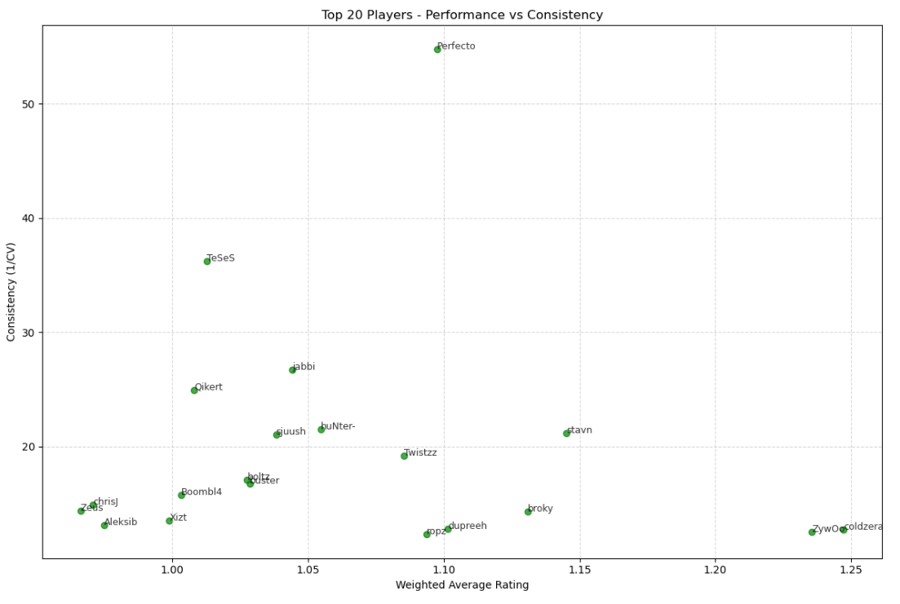

# Player Consistency vs Performance in CS:GO Majors

This project analyzes the **performance and consistency of professional CS:GO players** across all Major tournaments (2013–2023).  
The focus is on understanding how stable (consistent) a player's performance is compared to their average rating, using statistical metrics.

---

## 📊 Metrics Calculated

- **Weighted Average Rating** – performance score adjusted by the number of rounds played.  
- **Weighted Variance & Standard Deviation** – measures of rating fluctuation across tournaments.  
- **Coefficient of Variation (CV)** – normalized variability (standard deviation / mean).  
- **Consistency** – inverse of CV (1/CV), higher values mean more stable performance.  

---

## 📐 Formulas Used

- **Weighted Average Rating**  
  

- **Weighted Variance**  
  

- **Weighted Standard Deviation**  
  

- **Coefficient of Variation (CV)**  
  

- **Consistency**  
  

---

## 🔍 Data Filtering

- **Challenger Stages** are excluded from the dataset.  
- Only players with at least **1000 total rounds** are included (to avoid unrealistic stats from small samples).  
- The minimum rounds filter can be changed in the code via the `min_rounds` variable.  

---

## 🚀 How to Run

1. Clone this repository  
   ```bash
   git clone https://github.com/Zolakovski/consistency-vs-performance.git
cd consistency-vs-performance

---

## 📈 Results

Here is the scatter plot showing the **Top 20 players** ranked by consistency and performance:




